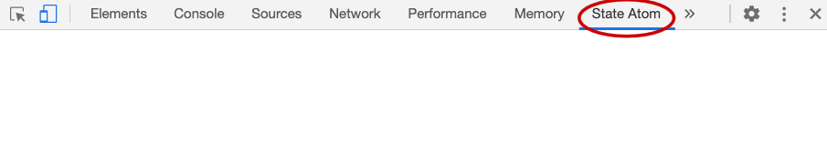

# State Atom DevTools

The DevTools extension for State Atom

## Table of Contents

-   [Install](#install)
-   [Usage](#usage)
-   [Contributing](#contributing)

## Install

### 1. For Chrome

-   from [Chrome Web Store](https://chrome.google.com/webstore/detail/state-atom-devtools/mhdnjcangakajcinldiniomklbmmjcka);
<!-- - or download `extension.zip` from [last releases](), unzip, open `chrome://extensions` url and turn on developer mode from top left and then click; on `Load Unpacked` and select the extracted folder for use -->
-   or build it with `yarn && yarn build` and [load the extension's folder](https://developer.chrome.com/extensions/getstarted#unpacked) `./dist`;
-   or run it in dev mode with `yarn && yarn dev` and [load the extension's folder](https://developer.chrome.com/extensions/getstarted#unpacked) `./dist`.

### 2. For Firefox

-   from [Mozilla Add-ons](https://addons.mozilla.org/it/firefox/addon/state-atom-devtools/);
-   or build it with `yarn && yarn build` and [load the extension's folder](https://developer.mozilla.org/en-US/Add-ons/WebExtensions/Temporary_Installation_in_Firefox) `./dist` (just select a file from inside the dir).
-   or run it in dev mode with `yarn && yarn dev` and [load the extension's folder](https://developer.mozilla.org/en-US/Add-ons/WebExtensions/Temporary_Installation_in_Firefox) `./dist` (just select a file from inside the dir).

## Usage

When installed successfully you will find the `State Atom` tab in you devtools panel:

These devtools works with the dev build of state atom.
The glue code that makes these devtools work is stripped out from state atom when `NODE_ENV=production`,

## Contributing

In order to test the extension locally you could run `yarn start:chrome` or `yarn start:firefox` in order to spawn a browser with the extension installed.
